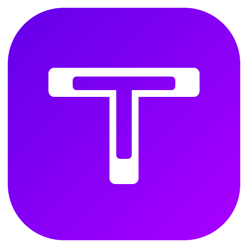

<div align="center">
  

  # TabTube

  **A private YouTube client — with tabs.**

  <em>TabTube is an <strong>unofficial fork of <a href="https://github.com/FreeTubeApp/FreeTube">FreeTube</a></strong>, which it uses as its base. It is <strong>not affiliated with or endorsed by the FreeTube project</strong>.</em>
</div>

---

## What TabTube adds

TabTube is [FreeTube](https://github.com/FreeTubeApp/FreeTube) with **browser-style tabs**:

- **Open videos and channels in tabs** — middle-click or Ctrl/Cmd-click opens a new
  **background** tab (your current video keeps playing).
- **Truly independent tabs** — each tab is its own page, so switching tabs never resets or
  interrupts another. Background tabs **don't autoplay**; a tab starts playing only when you
  switch to it.
- **Real tab titles**, a loading indicator per tab, and a familiar tab bar (new-tab `+`,
  close `×`, middle-click to close).
- A **dark, indigo-violet** default theme.

Everything else is FreeTube — its player, subscriptions, playlists, privacy features, and
settings all work as usual.

## Install

Prebuilt installers for **Linux (AppImage)**, **Windows (.exe)**, and **macOS (.dmg)** are
produced by CI on each release — see the [Releases](https://github.com/mangofillet/TabTube/releases).

Builds are currently **unsigned**, so the OS shows a one-time warning:
- **macOS:** right-click the app → **Open** (or System Settings → Privacy & Security →
  *Open Anyway*).
- **Windows:** SmartScreen → **More info** → **Run anyway**.

## Built on FreeTube

TabTube is a derivative work of **FreeTube**, © the FreeTube contributors, used under the
**GNU AGPL-3.0**. Enormous credit to the FreeTube team — TabTube would not exist without their
work. Please consider [supporting FreeTube](https://github.com/FreeTubeApp/FreeTube#donate).

This is an independent, community fork. For the official app, see
[freetubeapp.io](https://freetubeapp.io/).

## License

TabTube is Free Software under the [GNU Affero General Public License v3.0 or later](LICENSE),
the same license as FreeTube. You may use, study, share, and modify it; if you redistribute it
(modified or not) you must pass on the same freedoms and provide the complete source.

## Build from source

Requires Node.js and [pnpm](https://pnpm.io/).

```bash
pnpm install
pnpm run dev            # run in development
pnpm run pack           # production bundles
node _scripts/build-appimage.mjs   # build the Linux AppImage
```

## Credits

- Based on **[FreeTube](https://github.com/FreeTubeApp/FreeTube)** (AGPL-3.0).
- Tabs, rebrand, and reskin assisted by **Claude Code**.
